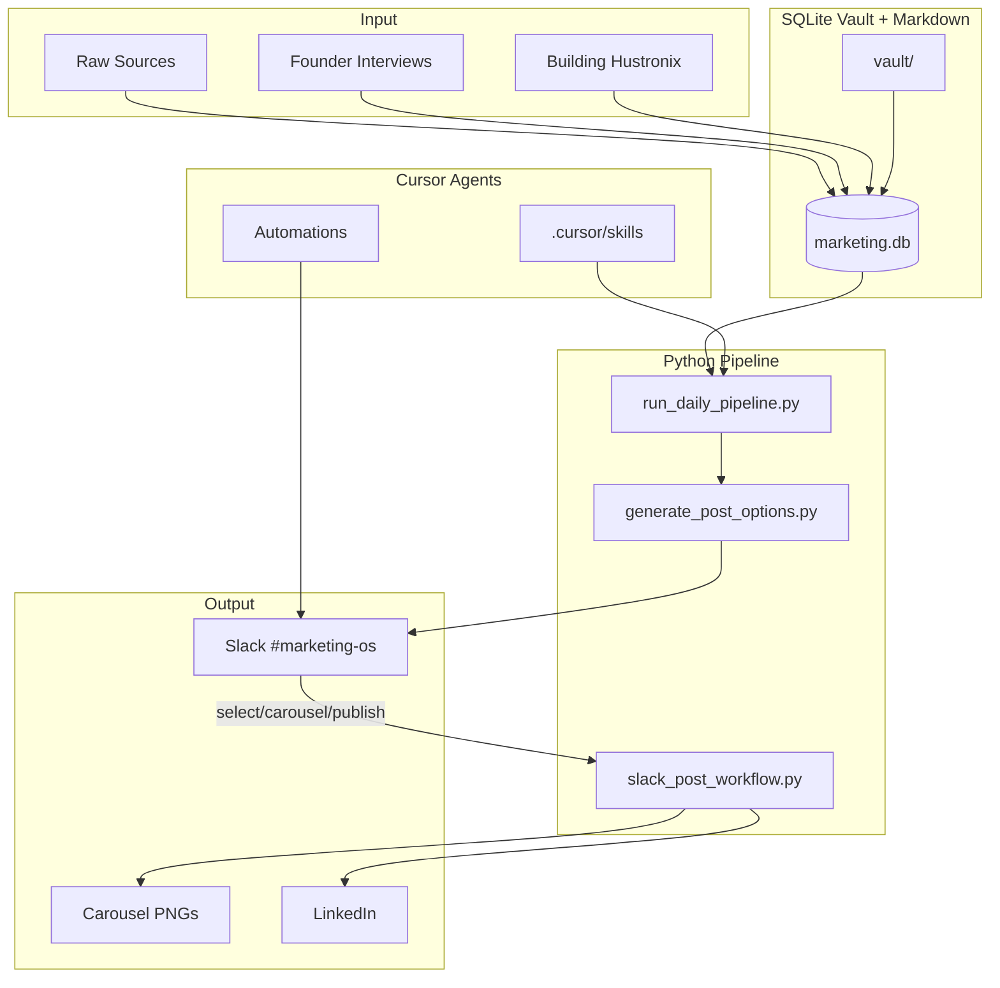
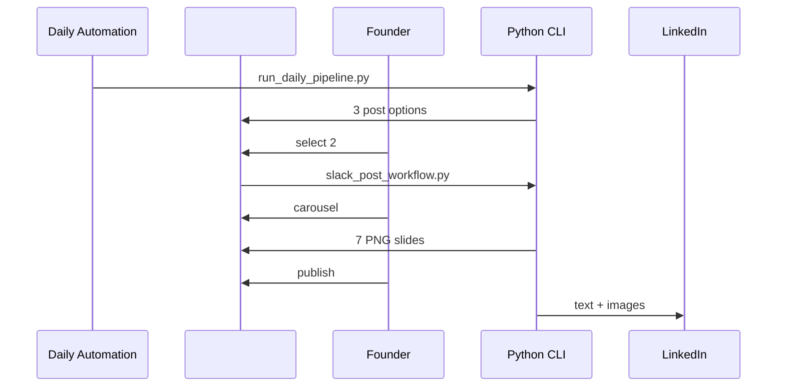

# Hustronix Content Ops

> Decision Intelligence for founder-led marketing — research, approve, publish, and learn without living in a terminal.

[](https://github.com/hustronix35-prog/hustronix-content-ops/actions/workflows/carousel.yml)
[](LICENSE)

---

## Overview

**Hustronix Content Ops** is an open-source marketing operating system for early-stage founders. It turns research and founder conversations into **publish-ready LinkedIn content** with strict voice quality gates, Slack-based approval, and intelligent carousel generation.

This is not a generic AI content tool. It is **decision infrastructure for marketing** — dogfood for [Hustronix](https://github.com/hustronix35-prog)'s Decision Intelligence thesis.

---

## Problem

Founders need consistent, credible distribution. Most automation tools optimize for **volume** and produce **AI-slop**: repeated hedging, engagement bait, and clever lines without evidence.

Teams lack:

- Research → publish pipelines tied to real founder context
- Quality gates that enforce authentic voice
- Zero-terminal daily workflows
- Reusable systems that compound into product IP

---

## Solution

A vault-backed pipeline with Cursor agents, Python CLIs, and Slack commands:

```text
Research → 3 post options → select → carousel (optional) → publish → learn
```

Human approval at every publish step. Voice rules block mediocre patterns before they ship.

---

## Features

| Feature | Description |
|---------|-------------|
| **Content vault** | SQLite + markdown for sources, insights, founders, ideas |
| **Daily post options** | 3 tiered LinkedIn posts with Founder Voice v2.0 |
| **Slack workflow** | `select 1\|2\|3` → `carousel` → `publish` |
| **@mention chat** | Discuss quality and feedback in `#marketing-os` |
| **Intelligent carousels** | 7 slides derived from selected post content |
| **LinkedIn API** | Text + multi-image publish |
| **Agent skills** | 13 Cursor skills for research, writing, design, analytics |
| **Learning loop** | Content feedback + weekly recommendations |

---

## Architecture



See [docs/architecture.md](docs/architecture.md) for full system design.

---

## Workflow



---

## Screenshots

| Daily post options in Slack | Intelligent carousel |
|----------------------------|----------------------|
|  |  |

> Placeholders — replace with actual screenshots from `#marketing-os` and `assets/generated/*/preview.html`.

---

## Tech Stack

| Layer | Technology |
|-------|------------|
| Language | Python 3.12+ |
| Database | SQLite |
| Rendering | Playwright + HTML/CSS/SVG |
| Integrations | LinkedIn UGC API, Slack Web API |
| Agents | Cursor Skills + Automations |
| CI | GitHub Actions |

---

## Installation

```bash
git clone https://github.com/hustronix35-prog/hustronix-content-ops.git
cd hustronix-content-ops

python -m venv .venv
# Windows: .venv\Scripts\activate
# macOS/Linux: source .venv/bin/activate

pip install -r requirements.txt
python scripts/setup_carousel_env.py
python scripts/init_db.py
python scripts/seed_vault.py   # optional sample data
```

---

## Configuration

Copy environment template:

```bash
cp .env.example .env
```

| Variable | Required | Purpose |
|----------|----------|---------|
| `LINKEDIN_ACCESS_TOKEN` | For publish | LinkedIn OAuth token |
| `LINKEDIN_AUTHOR_URN` | For publish | `urn:li:person:...` |
| `SLACK_BOT_TOKEN` | For carousel upload | Bot token `xoxb-...` |
| `SLACK_CHANNEL_ID` | For carousel upload | Channel ID `C...` |

See [automations/SLACK_LINKEDIN_SETUP.md](automations/SLACK_LINKEDIN_SETUP.md).

---

## Usage

### Daily pipeline (local)

```bash
python scripts/run_daily_pipeline.py
python scripts/generate_post_options.py
```

### Slack workflow

```text
select 2      # pick post option
carousel      # generate + upload slides
publish       # post to LinkedIn
```

### @mention chat

```text
@Hustronix what do you think of option 3?
```

### Query vault

```bash
python scripts/vault_query.py stats
python scripts/vault_query.py list content_ideas --status pending
```

---

## Example Workflow

1. **7:00 AM** — Automation posts 3 options to `#marketing-os`
2. **Review** — `@mention` bot for feedback or `select 3`
3. **Optional** — `carousel` to preview slides in Slack
4. **Publish** — `publish` posts text + images to LinkedIn
5. **Learn** — Feedback saved to `vault/learning/content-feedback.md`

---

## Folder Structure

```text
.cursor/rules/       Brand, voice, design constraints
.cursor/skills/      Agent skill definitions
.github/             CI workflows, issue/PR templates
analytics/           Metrics and generated reports
assets/brand/        Logos, CSS design system
assets/generated/    Carousel output (gitignored)
automations/         Cursor Automation prefills + setup
data/                SQLite vault (gitignored)
docs/                Architecture, product, portfolio docs
scripts/             CLI entry points + lib/
vault/               Markdown content artifacts
```

---

## Design Decisions

| Decision | Rationale |
|----------|-----------|
| SQLite over Postgres | Zero-config for solo founder; portable portfolio demo |
| Slack as control plane | Zero-terminal daily workflow |
| Human publish gate | Never automate mediocrity at scale |
| Founder Voice v2.0 | Hard ban on stacked uncertainty phrases |
| Post-intelligent carousels | Slides follow selected post, not fixed story |
| Cursor agents | Skills as versioned product artifacts |

See [docs/engineering-recommendations.md](docs/engineering-recommendations.md).

---

## Limitations

- Single-user SQLite vault (not multi-tenant)
- Cursor Automations required for fully zero-terminal ops
- LinkedIn personal profile only (not company page)
- No automated token refresh
- Cloud automation secret injection depends on Cursor platform

---

## Roadmap

- [ ] pytest suite for voice validation and workflow state
- [ ] Docker Compose one-command bootstrap
- [ ] Parameterized repo config for forks
- [ ] Decision pattern auto-extraction from founder calls
- [ ] Metrics dashboard (founder DB progress → 100)
- [ ] Company page LinkedIn support

---

## Contributing

See [CONTRIBUTING.md](CONTRIBUTING.md). We welcome improvements to voice rules, carousel layouts, integrations, and documentation.

---

## License

MIT — see [LICENSE](LICENSE).

---

## Contact

**Hustronix** · Decision Intelligence for founders  
Repository: [github.com/hustronix35-prog/hustronix-content-ops](https://github.com/hustronix35-prog/hustronix-content-ops)

Portfolio case study: [docs/portfolio-case-study.md](docs/portfolio-case-study.md)

Quickstart (10 min): [docs/QUICKSTART.md](docs/QUICKSTART.md)
