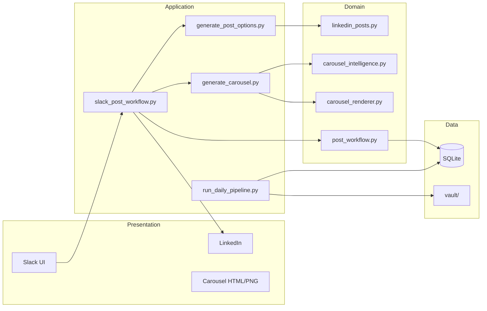
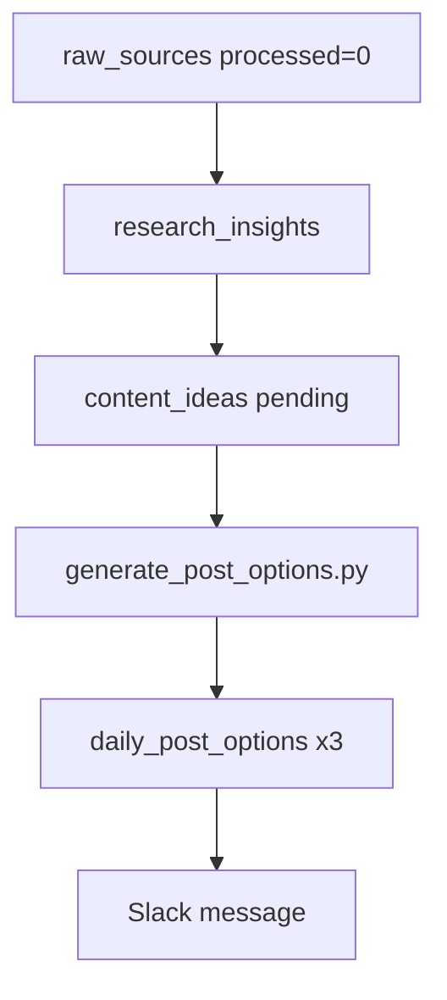
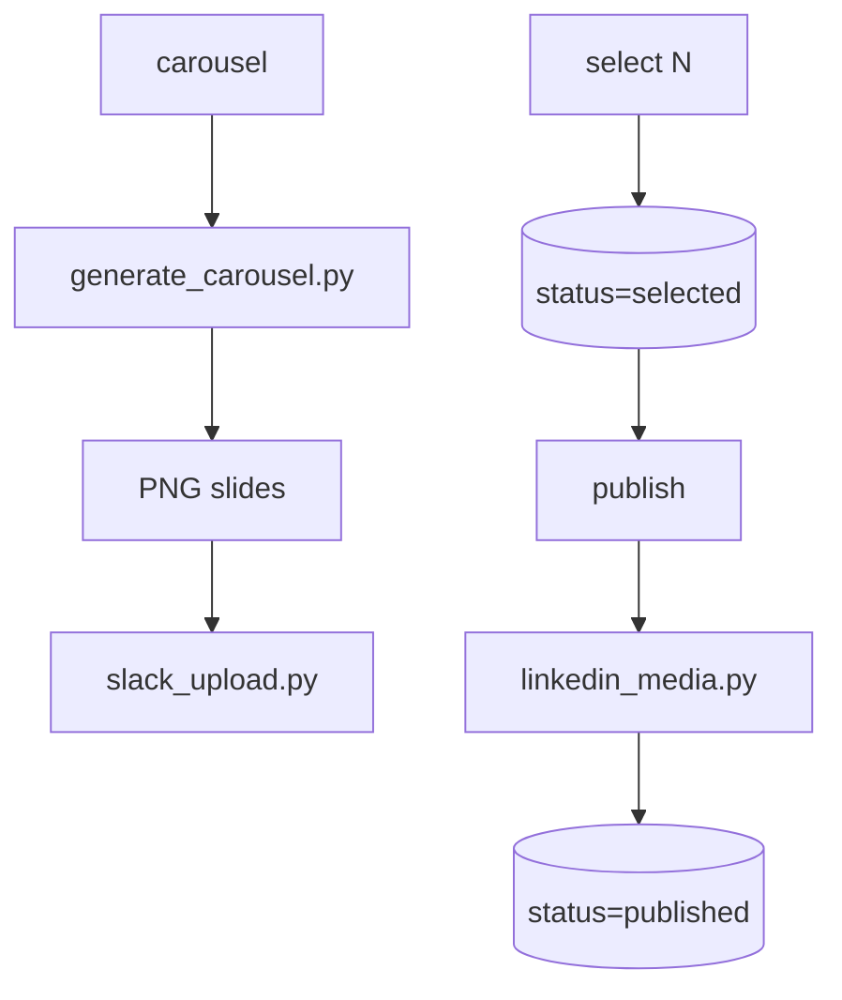
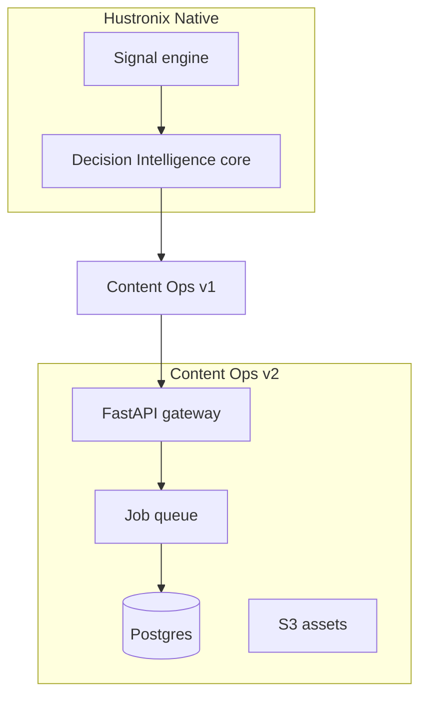

# Architecture — Hustronix Content Ops

## System Components

| Component | Responsibility |
|-----------|----------------|
| **Vault (SQLite)** | Sources, insights, ideas, drafts, post options, workflow state |
| **Vault (markdown)** | Long-form artifacts, learning, published distribution notes |
| **Pipeline scripts** | Orchestrate daily research → options → digest |
| **Post generator** | Founder Voice v2.0 body generation with quality enforcement |
| **Carousel intelligence** | Derive 7 slides from hook + body + metadata |
| **Carousel renderer** | Playwright PNG export from HTML/CSS/SVG |
| **Slack upload** | External file upload API for PNG review |
| **LinkedIn media** | UGC API text + multi-image posts |
| **Cursor skills** | Agent behavior specs (research, writer, design, analytics) |
| **Automations** | Cron + Slack triggers for cloud execution |

---

## Data Flow

### Daily generation

### Publish flow

---

## Dependencies

| Dependency | Role |
|------------|------|
| Python 3.12+ | Runtime |
| Playwright + Chromium | Headless PNG render |
| PyYAML | Design brief parsing |
| stdlib sqlite3, urllib | DB + HTTP APIs |

No web framework. CLI-first architecture.

---

## External Integrations

| Service | Integration | Auth |
|---------|-------------|------|
| **LinkedIn** | UGC Posts + Asset Upload | OAuth bearer token |
| **Slack** | Message triggers + file upload | Bot token |
| **Cursor Cloud** | Agent execution + automations | Platform auth |
| **GitHub** | Source + CI | Actions |

---

## Failure Points

| Failure | Impact | Mitigation |
|---------|--------|------------|
| LinkedIn token expiry | Publish fails | Regenerate token; document in SECURITY.md |
| Slack upload `invalid_arguments` | No PNG in channel | Form-encoded API (fixed in slack_upload.py) |
| Playwright missing | No PNG render | `setup_carousel_env.py` |
| Empty vault | Stale post options | Seed + ingestion pipeline |
| Cursor secrets not injected | Cloud publish fails | Dashboard secrets + local `.env` fallback |
| Voice rule regression | Mediocre posts | `validate_voice()` + content-feedback.md |

---

## Scaling Considerations

**Current:** Single-founder, single SQLite file, single Slack channel.

**Scale path:**

1. Postgres + row-level tenant isolation
2. Queue-based job runner (carousel render is CPU-heavy)
3. S3 for generated assets
4. Webhook router instead of Slack-only triggers
5. Cached post generation with idempotency keys

---

## Security Considerations

- Secrets in `.env` / Cursor Dashboard only — never committed
- Slack bot scoped to `files:write`, `chat:write`, `channels:read`
- LinkedIn `w_member_social` minimum scope
- Private Slack channel exposes data in automation run history (documented)
- No SQL injection risk (parameterized queries throughout)
- Sample founder data in vault is synthetic/demo

See [SECURITY.md](SECURITY.md).

---

## Future Architecture

See [docs/V3_HUSTRONIX_NATIVE.md](V3_HUSTRONIX_NATIVE.md).
