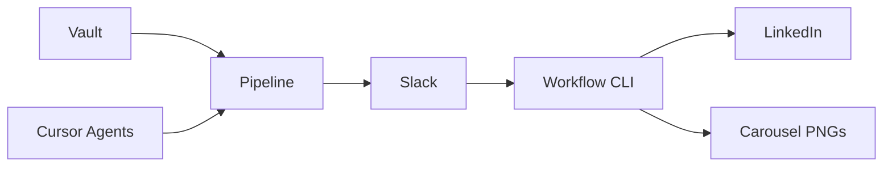

# Portfolio Case Study — Hustronix Content Ops

**Read time:** ~4 minutes  
**Role demonstrated:** Founder / Staff Engineer building decision infrastructure

---

## Background

Hustronix is a startup focused on **Decision Intelligence** — systems that help founders make better calls under uncertainty. Content marketing is the first commercial surface: founders need credible LinkedIn presence, but generic AI tools optimize for volume and produce **AI-slop**.

I built Content Ops to dogfood our thesis: a marketing operating system where **quality gates, human approval, and learning loops** matter more than automated posting.

---

## Problem

| Challenge | Impact |
|-----------|--------|
| Founder time is scarce | < 30 min/day budget for marketing |
| AI content tools lack judgment | Repeated hedging, engagement bait, no evidence |
| No research → publish loop | Content disconnected from founder conversations |
| Terminal-heavy workflows | Daily friction kills consistency |
| Carousel creation is manual | Canva/Figma for every post |

**Goal:** Ship founder-credible LinkedIn content daily without living in a terminal or sounding like ChatGPT.

---

## Approach

1. **Vault-backed pipeline** — SQLite + markdown store sources, insights, ideas, and workflow state
2. **Founder Voice v2.0** — Hard rules: Hook → Observation → Example → Insight; max 1 uncertainty statement; banned phrase list
3. **Slack as control plane** — `select` → `carousel` → `publish` commands; @mention chat for feedback
4. **Intelligent carousels** — 7 slides derived from selected post content (not fixed templates)
5. **Cursor agents** — 13 skills + 3 automations for zero-terminal daily ops
6. **Learning loop** — Content feedback saved to vault; rules evolve from real founder review

---

## Architecture

**Stack:** Python 3.12, SQLite, Playwright, LinkedIn UGC API, Slack Web API, Cursor Automations.

Key design choice: **CLI-first, no web framework** — every step is scriptable, testable, and automation-friendly.

---

## Challenges

| Challenge | Solution |
|-----------|----------|
| Cloud automation ran stale code | Pushed full pipeline to GitHub; documented branch pinning |
| Slack carousel upload failed | Fixed API: form-urlencoded POST, not JSON |
| Posts sounded generic | Rewrote generator + voice rules; 0 uncertainty flags after v2 |
| LinkedIn URN confusion | Documented `urn:li:person:{sub}` from OAuth, not display name |
| Cursor secret injection gaps | Dual path: Dashboard secrets + local `.env` fallback |

---

## Trade-offs

| Choice | Why | Cost |
|--------|-----|------|
| SQLite over Postgres | Zero-config for solo founder demo | Not multi-tenant |
| Human publish gate | Never automate mediocrity | Extra click daily |
| Cursor-coupled automations | Best zero-terminal UX today | Harder to run without Cursor |
| Post-intelligent carousels | Authentic to selected content | More complex than fixed template |

---

## Results

- **End-to-end workflow live:** 3 daily options → Slack approval → carousel → LinkedIn publish
- **Voice quality gate:** Internal scoring improved from ~6.8 (generic) to ~8.8 (contrarian gold standard)
- **7/7 carousel PNGs** uploaded to Slack after API fix
- **LinkedIn publish verified** with real post (`urn:li:share:7473702422855561216`)
- **13 agent skills** + brand/voice rules as versioned product artifacts
- **Portfolio documentation:** Architecture, product docs, OSS readiness, resume bullets

---

## Lessons Learned

1. **Quality gates beat volume** — One contrarian post with evidence beats three hedged options
2. **Slack is underrated as a control plane** — Founders already live there
3. **Dogfooding creates IP** — Every pipeline stage maps to future Hustronix product modules
4. **Document for recruiters** — A 5-minute case study matters as much as the code

---

## Future Improvements

- pytest suite for voice validation and workflow state
- Docker Compose one-command bootstrap
- Decision pattern auto-extraction from founder calls
- Metrics dashboard (founder DB progress → 100)
- Open API layer for non-Cursor integrations

---

**Repository:** [github.com/hustronix35-prog/hustronix-content-ops](https://github.com/hustronix35-prog/hustronix-content-ops)
