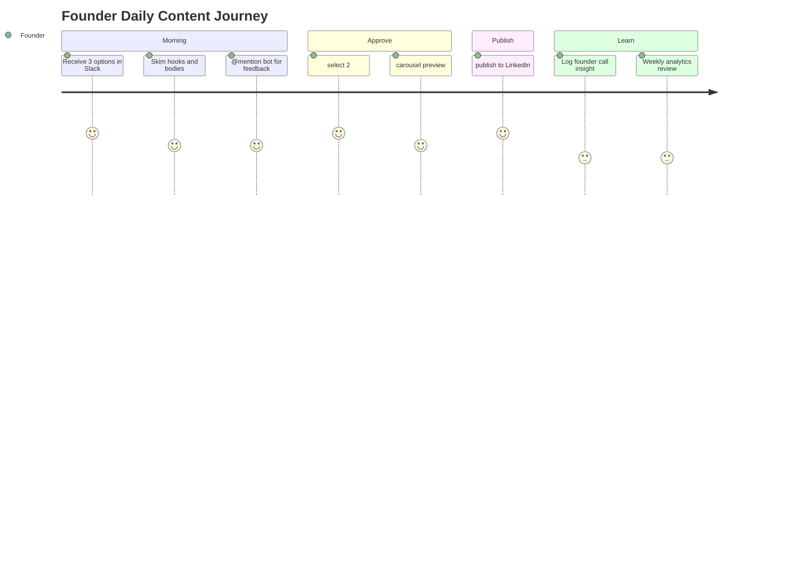

# Product Documentation — Hustronix Content Ops

## Problem

Early-stage founders need credible LinkedIn presence to attract customers, investors, and talent. Manual content creation is slow. Generic AI tools produce volume without judgment — and **automate mediocrity** at scale.

The deeper problem is **decision quality**: what to say, why it matters, and whether it reflects real founder observation vs. engagement bait.

---

## User Persona

**Primary:** Solo technical founder (Seed–Series A)

| Attribute | Detail |
|-----------|--------|
| Role | CEO / CTO building in public |
| Time budget | < 30 min/day on marketing |
| Tools today | Notion, Slack, LinkedIn, Cursor |
| Pain | Sounds like AI; no research loop; terminal-heavy workflows |
| Goal | Founder-credible posts that start real conversations |

**Secondary:** Early PMM / content lead at startup preparing for founder-led growth.

---

## Pain Points

1. **AI-slop posts** — stacked hedging, engagement bait, clever lines without evidence
2. **No research loop** — content disconnected from founder conversations
3. **Terminal fatigue** — doesn't want to run scripts daily
4. **Carousel friction** — manual Canva/Figma for every post
5. **No learning** — doesn't know which hooks/pillars perform
6. **Context loss** — decision rationale never captured

---

## User Journey

---

## Workflow

| Step | Actor | Action | System |
|------|-------|--------|--------|
| 1 | Automation | Generate 3 posts | `run_daily_pipeline.py` |
| 2 | Founder | Review in Slack | Daily Research automation |
| 3 | Founder | Discuss / feedback | @mention Marketing Chat |
| 4 | Founder | `select N` | `slack_post_workflow.py` |
| 5 | Founder | `carousel` (optional) | PNG upload to Slack |
| 6 | Founder | `publish` | LinkedIn API |
| 7 | Founder | Log conversations | founder-intelligence skill |
| 8 | System | Weekly learn | analytics + learning agents |

---

## Success Metrics

| Metric | Target | Type |
|--------|--------|------|
| Founders in intelligence DB | 100 | Primary KPI |
| Decision patterns captured | 200+ by month 12 | Strategic |
| Daily workflow time | < 30 min | Operational |
| Post voice quality score | ≥ 8.5/10 internal review | Quality |
| Uncertainty statements per post | ≤ 1 | Quality gate |
| Publish rate after options | Track conversion | Funnel |

Secondary: follower growth (meaningless without founder depth).

---

## Use Cases

### UC1 — Daily founder post

Founder receives 3 options at 7 AM, selects contrarian post on decision infrastructure, publishes with carousel before standup.

### UC2 — Strict quality feedback

Founder @mentions bot: "Option 2 sounds generic." Bot discusses revision. Feedback saved to `content-feedback.md`. Next generation applies rules.

### UC3 — Building in public

Builder post about dogfooding decision loops — authentic Hustronix narrative, minimal hedging.

### UC4 — Founder interview → content

After call, log conversation → extract decision pattern → next week's post options informed by vault.

### UC5 — Portfolio demo

Recruiter clones repo, runs pipeline locally, sees architecture docs and case study in < 5 minutes.

---

## Future Features

- Auto-extract decision patterns from founder call notes
- A/B hook testing with analytics feedback loop
- Multi-channel (Twitter/X thread export)
- Team approval (second reviewer gate)
- Company LinkedIn page support
- Dashboard for founder DB progress

---

## Business Impact

| Stakeholder | Impact |
|-------------|--------|
| **Hustronix** | Dogfoods Decision Intelligence; every subsystem → product IP |
| **Founders** | Credible distribution without content-team overhead |
| **Investors** | Demonstrates systematic GTM + learning loops |
| **Recruiting** | Portfolio proof of product + engineering depth |

Content Ops is the **first commercial surface** of Hustronix's thesis: better decisions, not more output.
